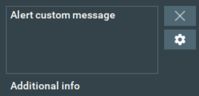
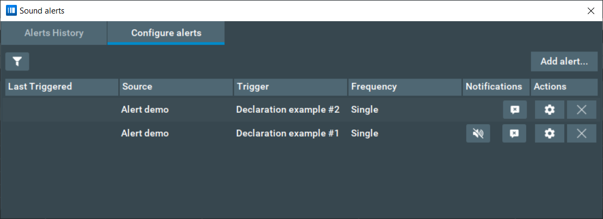
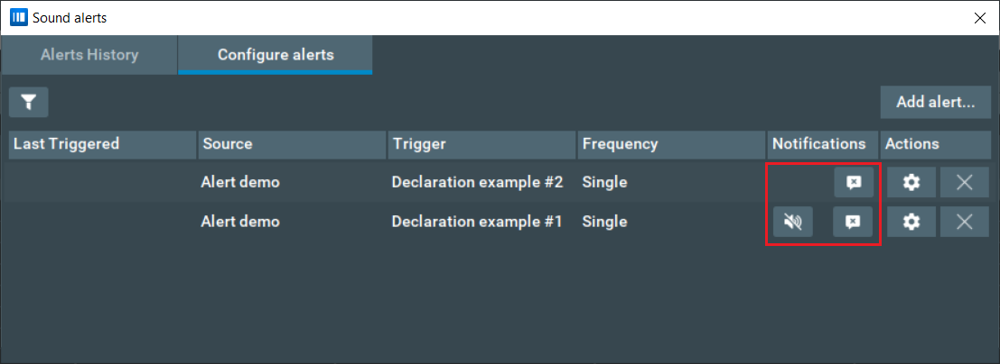

# Notification system guide

This document aims to familiarize Bookmap addons developers with the notification system API, show
its possibilities and explain the main concepts.

## What is the notification system, and why do I need it?

In short, the alert system helps to notify a user about some market event. Say, as a trader, you are
waiting for the price to drop to some specific value. Instead of spending your time watching the
chart, you could add an alert that will bring your attention only when it is needed. Here is how a
popup notification looks like:



The text message of the popup is defined by an addon. Notifications also can have a specific sound
alert - you can add some melody, or transform a text to sound. You can also specify the repeats
count and a delay between sounds for the sound alert - that is, if a user missed the first alert, they
will be notified by the repeats.

### Where can I see the code examples?

Take a look at `velox.api.layer1.simpledemo.alerts.Layer1ApiAlertDemo` from this project - load this
project's jar into Bookmap as an addon, select **Alert Demo** from the list of available addons.

### How do I start working with the notification system API?

This API is a part of Bookmap Layer1 API, so make sure that it is available in your addon project.
Also, it will be helpful to take a look at `velox.api.layer1.simpledemo.alerts.Layer1ApiAlertDemo` -
you may load it into Bookmap and manually send alerts and see how it works under the hood.

## Main concepts

Just like in many other places across the Bookmap API, your addon communicates with the Bookmap by
sending messages via `Layer1ApiAdminProvider#sendUserMessage(Object)` and obtaining them with
`Layer1ApiAdminListener#onUserMessage(Object)`. Alert system uses the following messages

- `Layer1ApiSoundAlertMessage`
- `Layer1ApiSoundAlertCancelMessage`
- `Layer1ApiSoundAlertDeclarationMessage`
- `Layer1ApiAlertGuiMessage`
- `Layer1ApiAlertSettingsMessage`

Let's take a look at each of them in detail

### Layer1ApiSoundAlertMessage

This message represents an alert - when Bookmap obtains it, a popup notification and sound alerts
occur (if applicable). The message is relatively easy to use, and if you want to get insight on what
each field in this message means - take a look at the javadoc. Note on
Layer1ApiSoundAlertMessage#alertDeclarationId Although _for now_
you can create a message without this field - it is not recommended.

For an example - take a look at `velox.api.layer1.simpledemo.alerts.SendAlertPanel`, where an
instance of `Layer1ApiSoundAlertMessage` is created.

The example in `SendAlertPanel` might seem overwhelming, as it tries to show all the functionality
of the alert system. Here is a much simpler example to get you started:

```
Layer1ApiSoundAlertMessage data = Layer1ApiSoundAlertMessage.builder()
    .setTextInfo("Hello, world!")
    .setSource(Layer1ApiAlertDemo.class)
    .setShowPopup(true)
    .build();
    
provider.sendUserMessage(data);    
```

This will show a popup with the text "Hello, world!".

Here the `provider` is an instance of `Layer1ApiProvider` that your addon obtains. The `source`
field is mandatory, and it should be a class annotated by `Layer1StrategyName`. In your addon you
should specify its entrypoint - just like for this demo the class `Layer1ApiAlertDemo` is.

### Layer1ApiSoundAlertCancelMessage

If you have a repeated `Layer1ApiSoundAlertMessage`, and you want to cancel it - use this message.
Specify a `Layer1ApiSoundAlertCancelMessage#soundMessagesFilter` which works as a predicate and
should return `true` for any message that needs to be canceled. Also, note that you can only cancel
messages which have the same `source` field as your `Layer1ApiSoundAlertCancelMessage`.
`

### Layer1ApiSoundAlertDeclarationMessage

This message helps Bookmap to create a centralized space for managing alerts. With this message, an
addon declares its intention of sending `Layer1ApiSoundAlertMessage`'s of some form. Thus, before
sending a
`Layer1ApiSoundAlertMessage`, your addon should create and send
the `Layer1ApiSoundAlertDeclarationMessage`. This creates a new record in the _Sound Alerts_ dialog, 
available via _File -> Alerts -> Configure alerts_. Below is an example of this dialog with 2
alert declarations - one capable of creating a popup and sound notifications, another - supporting
only popup alert.



As you may see, declaration #1 has 2 buttons, and declaration #2 - only 1. *Here is the major note:*
The `Layer1ApiSoundAlertDeclarationMessage` indicates whether a linked alert **can** have a
sound/popup notification, but the actual state (on/off) is defined by another message - `Layer1ApiAlertSettingsMessage`

Also, take a look at the "cancel" button on the image above. When a user clicks it, your addon will
obtain the same `Layer1ApiSoundAlertDeclarationMessage` for which this event occurred, but with a
flag
`Layer1ApiSoundAlertDeclarationMessage#isAdd = false`. **Bookmap expects that your addon will stop
sending alerts described by this declaration.**

Also, to the left you may see a "Filter" button - this allows a user to conveniently filter out alerts
declarations based on its properties.

Thus, if your addon declares alerts - it should also listen
for `Layer1ApiSoundAlertDeclarationMessage`'s, as well as `Layer1ApiAlertSettingsMessage`'s. 
As an example - take a look at the implementation of `Layer1ApiAlertDemo#onUserMessage(Object)`

### Layer1ApiAlertGuiMessage

This message allows you to add your control GUI for alerts into Bookmap. Usually an addon
would register this GUI after it's been activated - for example, check out
`Layer1ApiAlertDemo#onStrategyCheckboxEnabled(String, boolean)`.
_Note:_ if your addon doesn't implement the `Layer1ApiInstrumentSpecificEnabledStateProvider`, you
might want to send the `Layer1ApiAlertGuiMessage` after your addon
obtained `UserMessageLayersChainCreatedTargeted`.

If you want to see such GUI in action - load *Alert Demo*, enable it by clicking a checkbox in
the `Configure addons` dialog. After this, open _File -> Alerts -> Configure alerts_. To the right,
you will see an "Add alert..."
button. Click it, and there will be a list of addons, that specified a GUI for alerts configuration.
To the right, you may see the actual GUI panels. For the source code - take a look at
`velox.api.layer1.simpledemo.alerts.DeclareOrUpdateAlertPanel`, and how its instance is used in
`Layer1ApiAlertDemo`.

The main field of `Layer1ApiAlertGuiMessage` that does all the job of passing GUI panels is
`Layer1ApiAlertGuiMessage#guiPanelsProvider`. As you may see, it is
a `Function<Layer1ApiSoundAlertDeclarationMessage, StrategyPanel[]>` - that is, Bookmap invokes the
function with `Layer1ApiSoundAlertDeclarationMessage` **or null** as an argument and shows obtained
GUI.

There are 2 possible intents of opening your GUI panels:

- Create a new alert - your GUI was opened via the "Add alert..." button - in such case the arg is
  **null**
- Update an existing alert - GUI was opened by "configure alert" button - `guiPanelsProvider` obtains
  a `Layer1ApiSoundAlertDeclarationMessage`, which needs to be configured. In such a case, you can
  pre-populate the fields of your GUI with those provided by the declaration message.

### Layer1ApiAlertSettingsMessage

This message specifies the status of sound/popup notifications for an alert. Alerts are connected
with the `Layer1ApiAlertSettingsMessage` via `declarationId`. By default, when Bookmap obtains a
`Layer1ApiSoundAlertDeclarationMessage`, it assumes that there is a `Layer1ApiAlertSettingsMessage`
with fields `sound = false`, `popup = false`. This also can be seen in _File -> Alerts -> Configure
alerts_.



Take a look at buttons in the red frame - by default, their state is "disabled". Your addon may
change it by sending `Layer1ApiAlertSettingsMessage` with the desired state of sound and popup
notifications. Also, if a user clicks on any of these buttons - your addon will obtain
a `Layer1ApiAlertSettingsMessage`
with updated fields. Thus, your addon has to listen to these messages and update its inner state
accordingly. Later, it should send `Layer1ApiSoundAlertMessage` with correct `sound`/`popup` fields.
If they diverge from those specified in the `Layer1ApiAlertSettingsMessage` registered in Bookmap -
**an exception will be thrown, your addon will be unloaded**.

## Notification system workflow summed up

1. (Optional) Addon registers a control GUI with `Layer1ApiAlertGuiMessage`
2. For every alert type, addon sends a `Layer1ApiSoundAlertDeclarationMessage` and stores its `id`
   internally.
3. (Optional) Alert sends a `Layer1ApiAlertSettingsMessage` and _links the previously sent
   `Layer1ApiSoundAlertDeclarationMessage` via `declarationId`_. This sets the sound/popup settings
   for an alert declaration.
4. If an addon wants to send an alert - it creates a `Layer1ApiSoundAlertMessage` and _links a
   declaration message via `alertDeclarationId`_. This will show an alert.

Also, addon listens for `Layer1ApiSoundAlertDeclarationMessage` and `Layer1ApiAlertSettingsMessage`
that may arrive from Bookmap in reaction to user clicks.

- If a `Layer1ApiSoundAlertDeclarationMessage` with the flag `isAdd = false` arrives - addon should
  stop sending this type of messages.
- If a `Layer1ApiAlertSettingsMessage` arrives - addon should update its
  subsequent `Layer1ApiSoundAlertMessage`'s accordingly.

